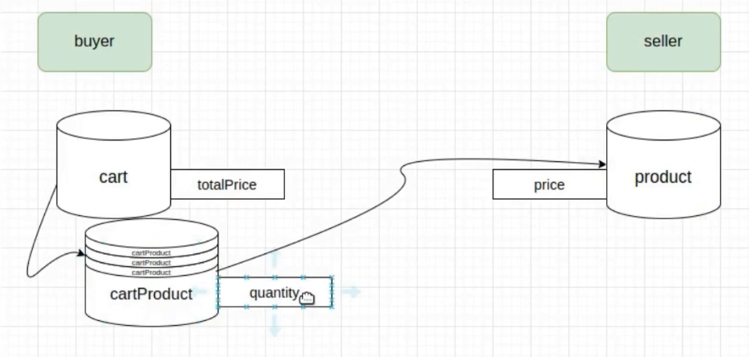

## API Shop App

### Services

- **Buyer Service**
  - User can add products to his shopping cart, and then he can pay for them using stripe chackout service. each order will be saved in the database.
- **Seller Service**
  - User can put hit own products for sell
- **Auth Service\_**
  - User should create an account to buy or sell products, but for the buyer, an account is only required if they want to make a payment.



### API shop app with express.

#### Stack

- [x] NodeJs
- [x] ExpressJs
- [x] MongoDB
- [x] Typescript

### Setup and initial project.

### Package in our app.

```
npm install mongoose
```

```
npm install express @types/express body-parser @types/body-parser cookie-session @types/cookie-session cors @types/cors dotenv @types/dotenv
```

```
npm install nodemon --save-dev
```

### Setup package.json file like this.

```
"scripts": {
    "compile": "tsc && node ./dist/src/main.js",
    "start": "nodemon -e ts --exec \"npm run compile\""
  },
```

and make sure you install nodemon in dev dependency.

run command

```
npm run start
```
